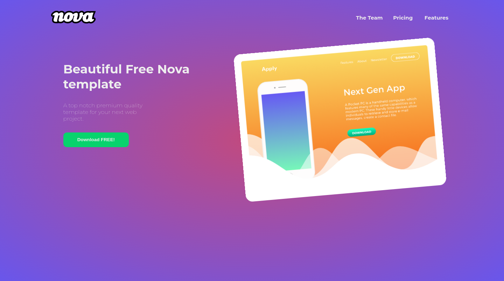

# Nova Template Project

See the live version of [Nova template project](https://mikepatch.github.io/nova-template-project/).

The project based on Nova template by Webscope. This is a simple project for practice semantic, BEM and styling elements.

**Main features**:
- Animation of header image.
- Animation of key elements of the page giving pleasant perception to the user.

&nbsp;
 
## 💡 Technologies

&nbsp;

## 🙋‍♂️ Feel free to contact me
Write sth nice ;)

&nbsp;

## 👏 Thanks / Special thanks / Credits
Thanks to my [Mentor - devmentor.pl](https://devmentor.pl/) – for providing me with this task and for code review.